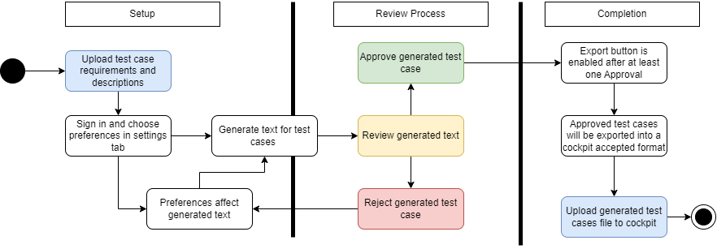
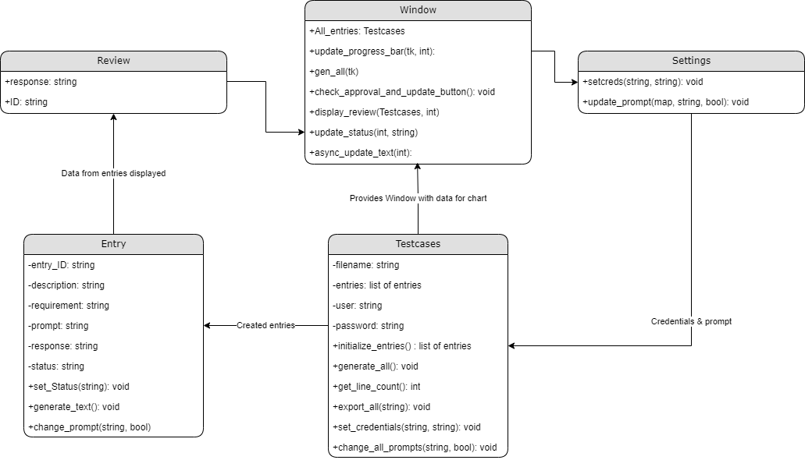

Application Purpose: The purpose of this application is to take in file input from cockpit and then using that file populate it with test case descriptions generated from AI and give the user the ability to review these test cases so that they can be validated, and then the validated test cases can then be exported into a CSV and Excel format to then be uploaded back to cockpit

Operating Procedure: 

-When running the Python script doing python .\window/py it will lauch the application and when running through the exacutable a command line will pop up along with a file selector. When starting a file menu will pop up and prompt the user for a file to be imported this file will be in the format of "ID, Description, Requirment" in a csv file. If this format is not met then the user will be prompted to enter another file. 

-Once the file is succesfully imported it will display on a chart with a scroll bar to the side with the ID numbers and various action buttons. The user can then go into settings to sign into microsoft copilot which currently is not working and modify the settings which are by default on as they should be. 

-Then by pressing the generate button the test cases that where imported will then have text generated for each one and this will update the progress bar at the bottom telling what percentage of the cases have had generated responses.

-Then by pressing the review button in each line of the chart the user can look at the generated text and determine if the generated text is resonable and if it is can then be approved with the approve button in that row of the chart. If the response is not resonable then the reject button can be pressed and in a short period of time the response for that single entry will be updated and will give the chance to review again.

-Once at least one of the test cases is approved the export button will become available and can be used to export on the test cases that have the aproved status in the chart. The export process will then start which will ask for the user to name the file and save to a directory. 

-The exported file can then be open in excel and then exported to cockpit.

--------------------------------------------------------------------------------------------------------------------

window.py: This is the main program that runs the script, it is responsible for the entire UI and the calls to the backend of the program. Within window.py the test cases class is created and is manipulated through the window.py

testcases.py: The test cases class takes in a file path and then parses it into seperate entrys with each entry stored in the object entry. All the entry instances are stored in an array in the testcase class and can be manipulated using the setter and getters

entry.py: In the entry class there are variable to hold all the information for generating a prompt along with the status that it is currently in. This status can be used to determine if the entry is ready to be exported. In the entry class there ais a function call to generate the text for the given prompt and then store that as a string that can later be parsed.

copilot_calls.py: In copilot_calls there is a function that inputs a string as a prompt for the AI to then return a string with the response in it. The copilot caoll function is in a differnt file so that in the future when we plan to change the AI to a proected Copilot that it will have easy intergration.

user.py: This stores the user data like password and username in a class that can then be accesed using getters and setters.

